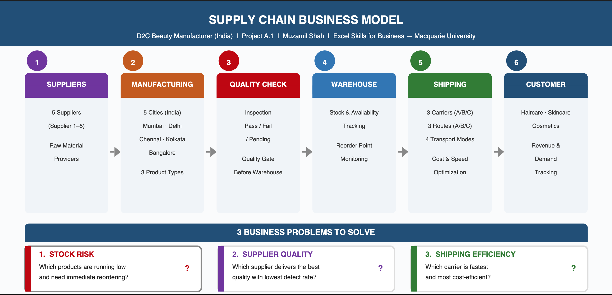
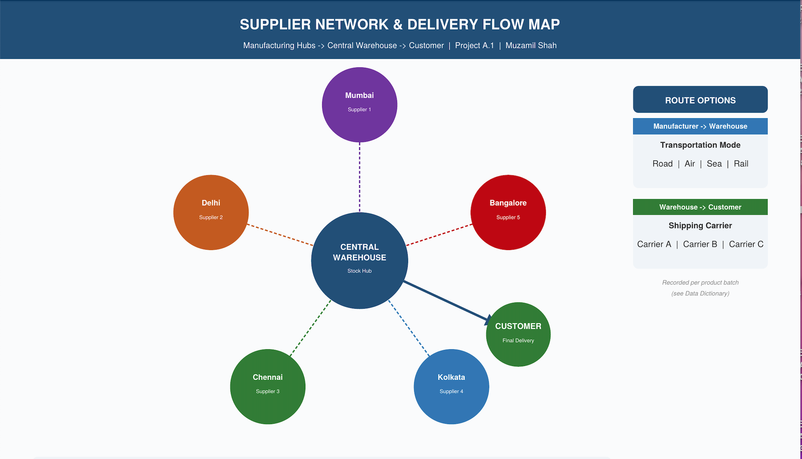
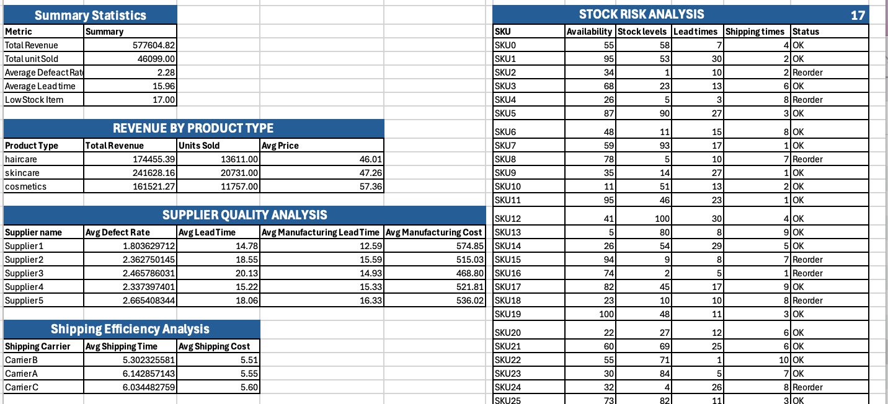
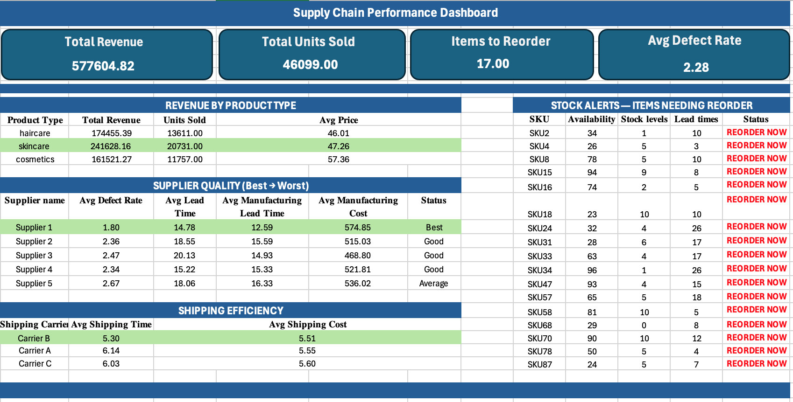
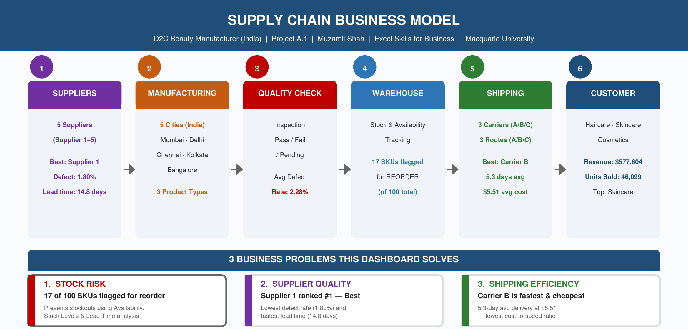

# Supply Chain Performance Dashboard
> Excel-based Intelligence Dashboard | D2C Beauty Manufacturer | Phase A — Data Engineering Journey

## 🎯 Business Problem
A D2C beauty manufacturer needs visibility into:
1. Which products need immediate reorder? (Stock Risk)
2. Which supplier has the lowest defect rate? (Quality)
3. Which carrier delivers fastest at lowest cost? (Logistics)
4. Which product category generates most revenue? (Strategy)

## 💡 Solution
Production-grade Excel dashboard with 6 sheets:
- Data Dictionary (LLM-ready documentation)
- Analysis (formulas, aggregations, lookups)
- Dashboard (CEO + Manager level views)
- Documentation (business context, CEO Q&A)
- Business Model (supply chain flow diagrams)

## 📊 Dataset
- **Source:** Kaggle — DataCo Smart Supply Chain Dataset
- **Link:** https://www.kaggle.com/datasets/shashwatwork/dataco-smart-supply-chain-for-big-data-analysis
- **Rows:** 100 SKUs (real anonymized D2C beauty data)
- **Columns:** 24 (price, inventory, suppliers, shipping, defects, costs)

## 🖼️ Dashboard Preview

### Business Flow (Questions Only)

### Supplier Network Map

### Analysis Sheet

### Dashboard

### Business Model with Results

## 📈 Key Findings
- ✅ 17 of 100 SKUs need immediate reorder (stock ≤ 10 units)
- ✅ Skincare is top revenue generator ($241,628 — 41.8% of total)
- ✅ Supplier 1 has lowest defect rate (1.80% — Best)
- ✅ Carrier B is fastest AND cheapest (5.3 days, $5.51/unit)
- ✅ Average defect rate: 2.28%

## 🏗️ Architecture
